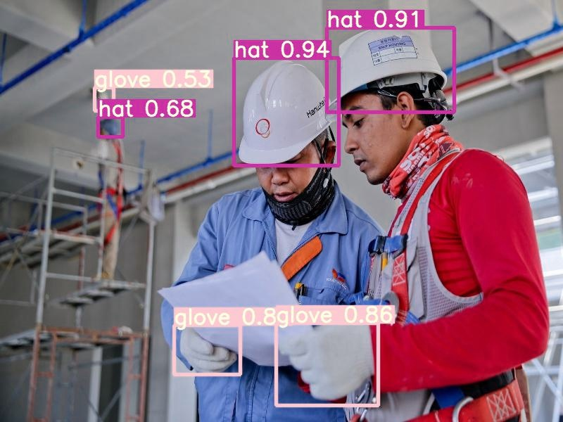

# PPE Detection Using YOLOv5  

## Overview  
Personal protective equipment (**PPE**) is essential for workplace safety, minimizing exposure to hazards that can cause serious injuries or illnesses. These hazards may include **chemical, radiological, physical, electrical, mechanical,** and other risks.  

PPE detection using **YOLOv5** automates the monitoring process, ensuring compliance with safety regulations by detecting whether workers are wearing the required protective gear. This solution is particularly useful in industries like **construction, manufacturing, healthcare, and hazardous environments.**  

## Applications  
This **PPE Detection System** can be applied in various sectors, including:  

- **Industrial Safety Compliance**: Ensures workers wear mandatory safety gear (e.g., helmets, gloves, masks, goggles, vests).  
- **Manufacturing & Construction Sites**: Monitors PPE adherence to prevent workplace injuries.  
- **Healthcare & Laboratories**: Ensures medical staff follow safety protocols by wearing masks, gloves, and gowns.  
- **Smart Surveillance Systems**: Integrates with CCTV cameras to detect PPE violations in real time.  
- **Automated Reports & Alerts**: Generates reports and sends alerts for PPE violations to supervisors.  

### SAMPLE OUTPUT IMAGE



## Setup and Usage  

### 1️⃣ Clone the Repository  
```bash
git clone https://github.com/parul2903/objectDetection_YOLOv5

